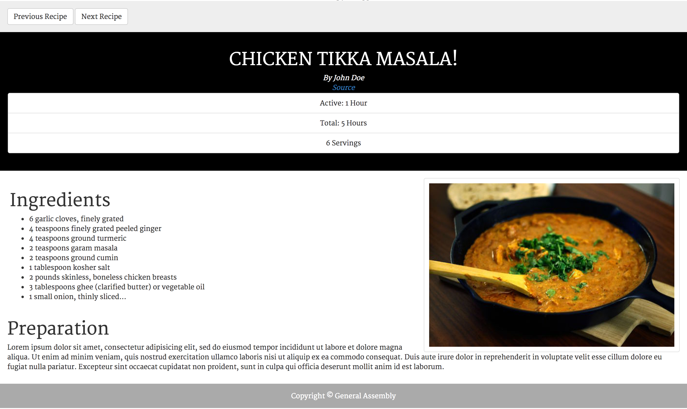

# React Recipes!!!

In this directory, you will find:

- A mostly empty React structure
- An `index.html` (in `public/index.html`) that has a bunch of stuff in it
- A JSON array of recipes

Your task is to:

- Take the `index.html` and separate it out into components
- Use the data in the recipes to populate those components
- Add some interactivity

There are three phases you'll go through to do this. Try to get as far as you can in completing them. Phase 3 is a bonus.

### Phase 1: Separate into components

Here is what `public/index.html` looks like originally:

In this phase, you will be taking the HTML in `public/index.html` and turning it into React components.

- Analyze this image and see what can be turned into components
- Create those components in `src/components`
- Using the existing HTML, reproduce the original look in React
- Remove the original HTML from `public/index.html`, **EXCEPT FOR** `

`. (If you remove this, things will _very break_.)

Add and commit your changes.

(Hint: You might have components `App`, `Header`, `RecipeData`, `Footer`. If you want to add more, that's ok! React encourages modularity and reusability.)

(Hint 2: Phase 3 will be easier if you leave the buttons in your `App` component.)

### Phase 2: Pass the data using props

Right now, you probably have lots of components with hard-coded data. Instead of hard-coding all the data, try passing it in as props.

- `recipes[0]` is the Chicken Tikka Masala recipe.
- Pass props into each of your components.

Add and commit your changes.

### Phase 3: Add some interactivity

Each of the recipes in the JSON file `recipes` has the same structure and properties. This means that, if you wanted to swap out the recipe, you can do it by just changing the object in the array you're accessing. Try this out by changing `recipes[0]` to `recipes[1]` in a couple of places.

We have some buttons that don't do anything yet! Let's add some functionality to them so they allow us to flip through recipes! Here's the pseudocode for it:

- Add methods `nextRecipe` and `prevRecipe` to your `App` components. Make sure to bind them.
- Add `onClick` properties on the buttons that reference `nextRecipe` and `prevRecipe`.
- Add a value to your state, `currentIndex`, which should be initialized at `0`. Adjust the way you're passing your props to reflect this. For example, `recipes[0].title` would become `recipes[this.state.currentIndex].title`
- `nextRecipe` should add 1 to the `currentIndex` and set the state.
- `prevRecipe` should subtract 1 from the `currentIndex` and set the state.
- **Remember not to modify state directly!!!!**

### Bonus!

Right now, if we go past the indeces where there are recipes (less than 0 or more than 2), the recipes app breaks. Add the following functionality:

- If the currentIndex is at 0, we can't go backwards.
- If the currentIndex is at 2, we can't go forwards.
